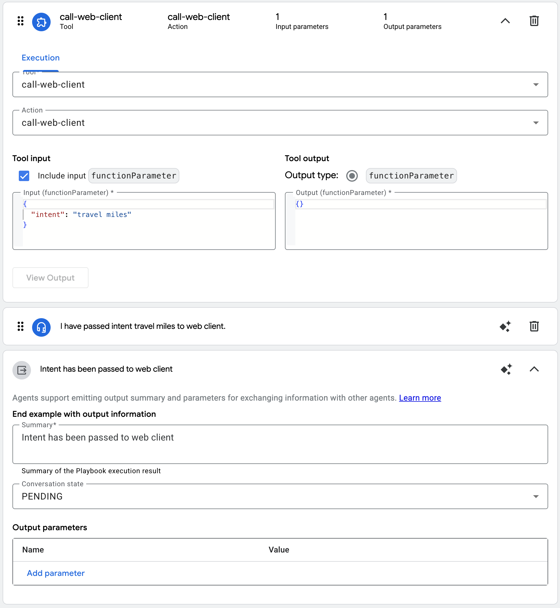

# Building Dynamic Web Experiences with Conversational Agent

In today's digital landscape, creating engaging and personalized web experiences is crucial for effective user interaction. With the advancement of Large Language Models (LLMs) and conversational AI, we can now build websites that dynamically adapt their content based on user interactions through natural language conversations.

In this blog, you'll learn how to:
- Create dynamic web pages that respond to user intents using Google Conversational Agent
- Use function tools to bridge the gap between conversation and web pages

We will demonstrate a simulated use case where customer is chatting with a Conversational Agents chatbot. When the customer is asking about baggage or frequent flyer miles, the webpage will change according to the intent respectively.

## What is Conversation Agent Function Tool?

A Conversation Agent Function Tool is a powerful feature that allows your chatbot to interact with external systems and trigger actions based on user conversations. In this article, we use it to:

1. Detect user intents from natural language input
2. Map those intents to specific function tool
3. Dynamically update the UI based on the conversation flow


## Playbook Configuration

Set up a new Function tool in Playbook with the following input/output schemas.

```yaml
# Input
type: object
required:
  - intent
properties:
  intent:
    type: string
    description: Intent for web client rendering.

# Output
null
```

Setup example:

```text
Customer want to check about travel miles. For example, customer asks the following questions:
- How can I earn Cymbal miles besides just flying with Cymbal Airlines?
- What can I use my accumulated Cymbal miles for?
- What are some of the general benefits I get as a Cymbal member?
- Are there different membership levels, and what additional perks do higher tiers offer?
- Where can I use my Cymbal miles for flights?

```

The rest of the configuration as follows:


## How to Setup Dynamic Web Experience

Setting up a dynamic web experience involves several key components:

1. **HTML Structure**
```html

<iframe id="webpage-container"></iframe>
```

2. **Chat Interface Integration**
```html
<df-messenger
  project-id="hello-world-418507"
  agent-id="75e7c898-526d-4789-8405-b496df0bf214"
  language-code="en"
  location="global"
  max-query-length="-1"
  allow-feedback="all">
</df-messenger>
```

3. **Function Tool Registration**

- Register a callback function when the playbook function tool is called.
- Refer to [documentation](https://cloud.google.com/dialogflow/cx/docs/concept/integration/dialogflow-messenger/fulfillment#playbook-rich) for more info.

```javascript
const toolId = "projects/hello-world-418507/locations/global/agents/75e7c898-526d-4789-8405-b496df0bf214/tools/198cba37-ed4f-494e-a704-f68383add43c"
const dfMessenger = document.querySelector('df-messenger');
dfMessenger.registerClientSideFunction(toolId, "call-web-client", renderWebpage)
```

The function tool works by:
```javascript
async function renderWebpage(input) {
    if (input.intent === "travel miles") {
        const iframe = document.getElementById('webpage-container');
        const backgroundImage = document.getElementById('background-image');
        
        iframe.src = "miles.html";
        iframe.style.display = 'block';
        backgroundImage.style.display = 'none';
    } else if (input.intent === "baggage") {
        const iframe = document.getElementById('webpage-container');
        const backgroundImage = document.getElementById('background-image');
        
        iframe.src = "baggage.html";
        iframe.style.display = 'block';
        backgroundImage.style.display = 'none';
    }
    return Promise.resolve({})
}
```

This function receives intents from the conversation and updates the webpage accordingly, creating a seamless integration between conversation and UI.


## How to demo?

- Open `dynamic_page_v1.html`
- Trigger demo playbook by typing `playbook`
- Type `check baggage` to display baggage page
- Type `check travel miles` to diaply krisflyer page

